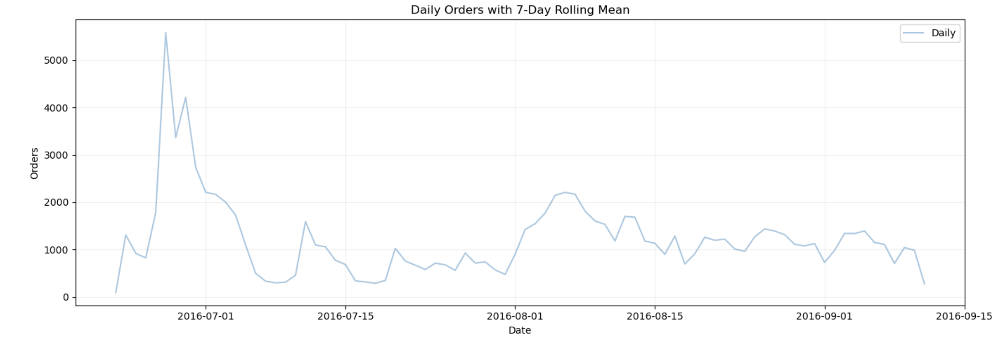

# German E-Commerce Customer Behaviour Analysis

**Author: Alfiya Ansari**

This repository contains a comprehensive analysis of German e-commerce
customer behaviour based on a 100,000-row dataset featuring customer
demographics, product information, transaction details, returns, and
temporal patterns. The goal of this project is to extract meaningful
insights regarding customer behaviour, product performance, return
patterns, and seasonal trends.

------------------------------------------------------------------------

## 📌 Project Overview

This project analyzes real-world German e-commerce data to uncover
behaviour patterns such as:

-   Customer demographics and geographic distribution
-   Registration trends over multiple years
-   Return behaviour and return-rate drivers
-   Price sensitivity and pricing trends
-   Product performance patterns
-   Size distribution of clothing and footwear
-   Day-wise and month-wise order cycles
-   Delivery performance and seasonal peaks
-   Correlation patterns and modeling implications

The analysis is supported with visualizations (see `/visuals/` folder).
Five screenshots will be added to complement the findings.

------------------------------------------------------------------------

## 📊 Detailed Insights

Below are the full, deep-dive insights extracted from the analysis:

### **1. Customer Demographics Reveal a Mature, High-Intent Shopper Base**

-   Most customers fall between **35--55 years**, forming the core
    revenue-generating audience.
-   Younger demographics (18--25) appear less engaged, suggesting either
    product alignment or onboarding inefficiencies.
-   Numerous age outliers suggest data-quality inconsistencies or older
    demographic participation.
-   **Implication:** Target campaigns toward middle-aged shoppers;
    explore UX improvements for younger demographics.

------------------------------------------------------------------------

### **2. Geographic Distribution Mirrors Population Density but Exposes Market Gaps**

-   **North Rhine-Westphalia** leads with the highest user count,
    followed by Bavaria, Lower Saxony, and Baden-Württemberg.
-   Underrepresented states (Bremen, Saarland, Mecklenburg-Vorpommern)
    indicate market expansion opportunities.
-   **Implication:** Region-specific marketing and logistics
    improvements could increase penetration in low-volume areas.

------------------------------------------------------------------------

### **3. Abnormal Registration Spike Points to System-Level Event**

-   A massive spike on **17 Feb 2015** (\>30k registrations) indicates a
    **bulk import/system migration**, not natural customer behaviour.
-   After removing this anomaly, daily registrations stabilize to
    realistic levels (0--50 per day).
-   Summer months show stronger registration counts; November--December
    shows a steep drop.
-   **Implication:** Outlier removal is mandatory for accurate
    forecasting.

------------------------------------------------------------------------

### **4. Return Behaviour: Half of All Orders Are Returned**

-   Return rate is extremely high at **\~51%**, consistent with German
    e-commerce norms.
-   **Company accounts** return the most (63%), likely due to bulk
    evaluations or resale.
-   **Mr/Mrs** users fall near the dataset average; **Not Reported**
    category returns the least.
-   **Implication:** Reducing returns via better size charts, improved
    product details, or ML-based fit prediction could significantly
    reduce costs.

------------------------------------------------------------------------

### **5. Price Has Minimal Impact on Return Decisions**

-   Price and returns show only **weak correlation (\~0.14)**.
-   Low-priced items dominate the catalog, especially under €100.
-   High-priced items (\>€300) are returned less frequently due to
    higher purchase consideration.
-   **Implication:** Return mitigation should focus on fit/expectation
    management rather than price strategy.

------------------------------------------------------------------------

### **6. Product Portfolio Shows Heavy Dependence on a Few SKUs**

-   A small subset of `item_id`s drives a large portion of total orders.
-   These likely represent bestsellers or recurring seasonal hits.
-   High-frequency items also contribute heavily to returns.
-   **Implication:** Optimize inventory forecasting and improve
    product-level fit information for high-volume SKUs.

------------------------------------------------------------------------

### **7. Size Distribution Shows a Predictable Mid-Range Trend**

-   Clothing sizes L, XL, and M dominate the dataset.
-   Footwear sizes cluster between 38--42.
-   **Implication:** Inventory allocation should favor these sizes;
    extreme sizes need careful stock control.

------------------------------------------------------------------------

### **8. Time-Based Patterns Reveal Weekly Rhythm and Seasonal Peaks**

-   **Monday** consistently shows peak order volume.
-   Weekend orders remain strong but slightly below weekday levels.
-   Summer months (**June--August**) show highest order and delivery
    counts.
-   Drops after September indicate dataset cutoff.
-   **Implication:** Marketing pushes should leverage strong Monday
    conversions and summer peaks.

------------------------------------------------------------------------

### **9. Delivery Performance Peaks in August 2016**

-   After cleaning null values, August leads with \~36k deliveries.
-   Near-zero deliveries post-September due to missing data.
-   **Implication:** Q4 delivery performance cannot be reliably
    analyzed.

------------------------------------------------------------------------

### **10. Weak Correlations Suggest Complex, Non-Linear Customer Behaviour**

-   Most variables exhibit near-zero correlation.
-   Only meaningful relationship: item ID vs. price (\~0.40
    correlation), likely due to product categorization.
-   **Implication:** Tree-based ML models (XGBoost, Random Forests,
    LightGBM) will outperform linear models.

------------------------------------------------------------------------

## 📁 Project Structure

    ├── data/                # Source dataset (not included here)
    ├── visuals/             # Exploratory data analysis screenshots
    ├── notebooks/           # Jupyter notebooks for analysis
    ├── README.md            # Project documentation
    └── reports/             # PDF reports (optional)

------------------------------------------------------------------------

## 🧠 Tools & Techniques Used

-   Python (Pandas, NumPy, Matplotlib, Seaborn)
-   Data cleaning & preprocessing
-   Exploratory data analysis
-   Time-series breakdown
-   Customer segmentation
-   Return behaviour modeling
-   Correlation and distribution analysis

------------------------------------------------------------------------

## 📌 Next Steps

-   Build a machine learning model to predict returns.
-   Create customer segments using clustering.
-   Perform RFM analysis for customer value scoring.
-   Incorporate more months of delivery data for funnel completion.

------------------------------------------------------------------------

## 📷 Visualizations (Screenshots to Be Added)

### 🖼 Screenshot 1 -- Daily Order With 7-Day Rolling Mean

### 🖼 Screenshot 2 -- Customer Demographics

*(Upload inside /visuals/ and link here)*

### 🖼 Screenshot 3 -- Return Behaviour Visuals

*(Upload inside /visuals/ and link here)*

### 🖼 Screenshot 4 -- Geographic Analysis

*(Upload inside /visuals/ and link here)*

### 🖼 Screenshot 5 -- Time-Based Trends

*(Upload inside /visuals/ and link here)*

------------------------------------------------------------------------

## 📄 License

This project is for educational and analytical purposes only.

------------------------------------------------------------------------

**Created by: *Alfiya Ansari***
